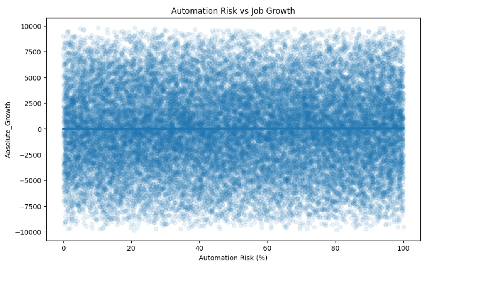
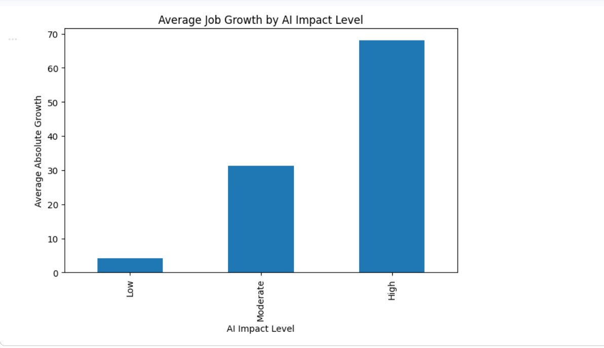
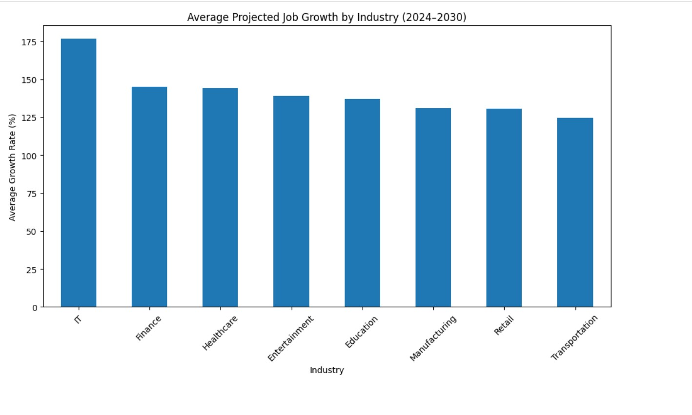

# AI Impact on the Job Market (2024–2030)

## Project Overview

This project analyzes how Artificial Intelligence may affect projected employment growth across industries between 2024 and 2030.

The analysis investigates whether automation risk, AI impact level, salary, and industry characteristics are associated with projected job growth.

## Research Questions

- Does automation risk predict job growth?
- Do AI-impacted occupations grow faster?
- Which industries benefit most from AI?
- Which industries are most vulnerable?

## Dataset

The dataset contains approximately 30,000 occupation records with variables including:

- Industry
- Job Status
- AI Impact Level
- Median Salary
- Required Education
- Experience Required
- Job Openings in 2024
- Projected Openings in 2030
- Remote Work Ratio
- Automation Risk
- Location
- Gender Diversity

Dataset source: Kaggle

## Tools Used

- Python
- Pandas
- NumPy
- Matplotlib
- Seaborn
- SciPy
- Google Colab

## Methods

- Exploratory Data Analysis
- Feature Engineering
- Correlation Analysis
- ANOVA Testing
- Industry Segmentation
- Growth Rate Analysis

## Key Findings

1. Automation Risk does not meaningfully predict projected job growth.
2. High AI Impact occupations show substantially higher projected growth than Low AI Impact occupations.
3. AI exposure does not correspond to higher salaries.
4. AI effects vary significantly by industry.
5. IT, Healthcare, and Entertainment appear best positioned for AI-driven expansion.
6. Transportation appears most vulnerable to contraction.

## Main Insight

AI does not appear to affect all industries equally. The analysis suggests that industry context matters more than automation risk alone when evaluating projected workforce transformation.

https://colab.research.google.com/drive/143a2EJSnuqQ1ch4dwsDj8Gtft8yehYjG?usp=sharing

## Visual Highlights

### Automation Risk vs Job Growth

### Average Job Growth by AI Impact Level

### Industry-Specific Effects of AI

### Salary by AI Impact Level

## Limitations

- The dataset appears synthetic.
- Several variables exhibit near-zero correlations.
- Findings should be interpreted as patterns within this dataset rather than real-world labor market forecasts.
- Job Status labels were inconsistent with calculated growth metrics.

## Project Files

- `AI_Impact_Job_Market_Report.pdf` — final executive report
- `AI_Impact_Job_Market_Analysis.ipynb` — full analysis notebook
- `ai_job_trends_dataset.csv` — dataset
- `images/` — visualizations used in the report
